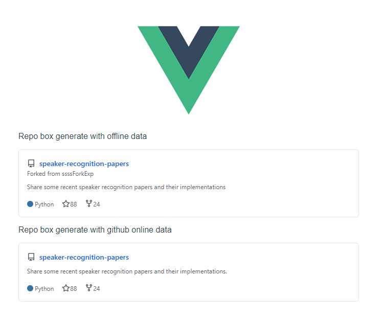

# repo-card-vue

Simple github repo card vue.js components.

## Demo
[Check Online Demo](https://vzxxbacq.github.io/repo-card-vue/)



## Usage

1. Use offline data
    
    ```vue
    <div>
      <RepoCard :OfflineData="myRepoData"/>
    </div>
    
    <script>
    export default {
      data(){
        return {
          myRepoData: {
            url: "https://github.com/vzxxbacq/speaker-recognition-papers",
            repoName: "speaker-recognition-papers",
            isFork: true,
            forkPath: "https://github.com/vzxxbacq/speaker-recognition-papers",
            forkName: "ssssForkExp",
            description: "Share some recent speaker recognition papers and their implementations",
            lang: "Python",
            stars: 88,
            forks: 24
          }
        }
      }
    }
    </script>
    ```

2. Use online data

    ```vue
    <div>
      <RepoCard :repo="myRepoData"/>
    </div>
    
    <script>
    export default {
      data(){
        return {
          repo: "vzxxbacq/speaker-recognition-papers"
        }
      }
    }
    </script>
    ```